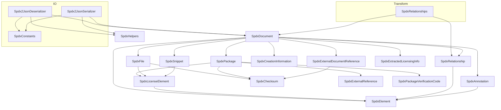
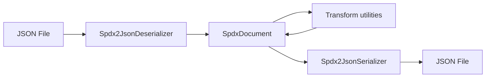

## SpdxModel

DemaConsulting.SpdxModel is a .NET library providing a complete implementation of the SPDX
(Software Package Data Exchange) data model. The library exposes an in-memory object model
representing all SPDX document elements, with serialization and transformation capabilities.

### Architecture

### External Interfaces

**SPDX JSON Input**: JSON file conforming to the SPDX 2.2 or 2.3 JSON schema.

- *Type*: File (JSON)
- *Role*: Consumer
- *Contract*: `Spdx2JsonDeserializer.Deserialize(string)` accepts raw JSON text and returns a
  populated `SpdxDocument`.
- *Constraints*: Input must be valid JSON; SPDX field validation is performed after
  deserialization via `SpdxDocument.Validate()`.

**SPDX JSON Output**: JSON file conforming to the SPDX 2.3 JSON schema.

- *Type*: File (JSON)
- *Role*: Provider
- *Contract*: `Spdx2JsonSerializer.Serialize(SpdxDocument)` returns a complete SPDX 2.3 JSON
  string.
- *Constraints*: Optional fields are omitted when empty or null; output always conforms to SPDX
  2.3 schema.

**In-Process .NET Public API**: Object model and transformation API consumed by .NET callers.

- *Type*: In-process .NET public API
- *Role*: Provider
- *Contract*: Exposes `SpdxDocument` and all data model classes, `Spdx2JsonDeserializer`,
  `Spdx2JsonSerializer`, and `SpdxRelationships` as public types.
- *Constraints*: Targets `netstandard2.0`, `net8.0`, `net9.0`, and `net10.0`.

#### Error Handling

- `Spdx2JsonDeserializer.Deserialize` throws `System.Text.Json.JsonException` when the input is
  fatally malformed JSON (i.e., the input cannot be parsed as a JSON document). Missing or unknown
  SPDX fields do not cause an exception; they are silently ignored or left at their default values.
- `SpdxDocument.Validate(List<string>)` never throws; it appends human-readable issue strings to
  the supplied list and returns normally, allowing callers to inspect all issues at once.

### Dependencies

- **System.Text.Json**: used by the IO subsystem for JSON DOM parsing and serialization;
  available in-box on modern .NET targets and via NuGet for .NET Standard 2.0.

### Risk Control Measures

N/A - not a safety-classified software item.

### Data Flow

1. Caller provides a JSON string to `Spdx2JsonDeserializer.Deserialize`.
2. The deserializer uses `System.Text.Json.Nodes` to parse the JSON DOM.
3. Per-element helpers populate a new `SpdxDocument` instance.
4. The caller inspects or modifies the `SpdxDocument` in memory, optionally using
   `SpdxRelationships` utilities.
5. `Spdx2JsonSerializer.Serialize` traverses the `SpdxDocument` and produces a JSON string.

### Design Constraints

- Targets `netstandard2.0`, `net8.0`, `net9.0`, and `net10.0` simultaneously; the library builds
  and runs on Windows, Linux, and macOS.
- Minimal runtime dependencies: relies on BCL/framework APIs where possible; compatibility NuGet
  packages used on older targets.
- Nullable reference types enabled: all public API members declare nullability explicitly.
- Data model classes use public mutable properties to allow flexible construction; deep-copy
  methods provide safe cloning.
- No static mutable state in data model classes; thread safety is the caller's responsibility.
